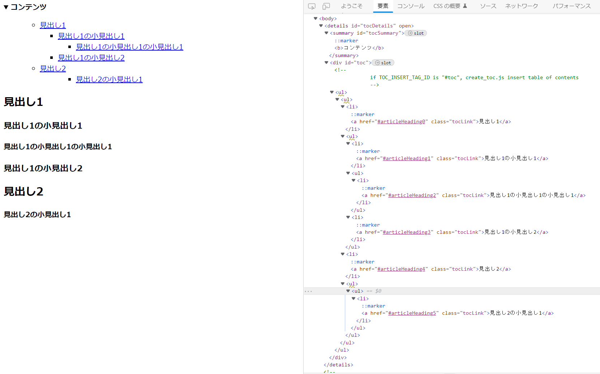

# create-toc-js

code of creating table of contents written in javascript
 
# DEMO
 

 
# Features
 
- Create a table of contents using pure javascript only, without using libraries
 
# Usage
 
Add TOC_HEADER_CLASS_NAME from create_toc.js to the class of the heading tag for which you want to create a table of contents, and specify TOC_INSERT_TAG_ID for the id of the tag in which you want to insert the table of contents, then run create_toc.js
 
# Note
 
If you need to deal with errors when creating the table of contents, please add them.
 
# License
ライセンスを明示する
 
"create-toc-js" is under [MIT license](https://en.wikipedia.org/wiki/MIT_License).
 